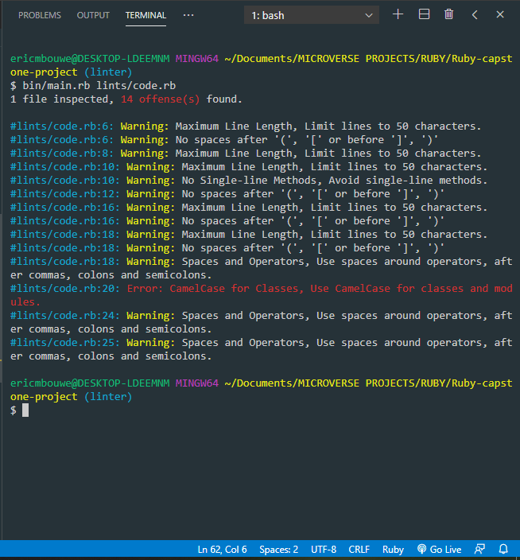

[](mailto:consult.ericmbouwe@gmail.com) [](https://twitter.com/EricMbouwe)

# Ruby Linter

This is a [linter](https://sourcelevel.io/blog/what-is-a-linter-and-why-your-team-should-use-it) developed in Ruby for Ruby (.rb) files. It's a linter for beginners, it provides feedback about errors or warning in code line by line by :
- flagging bugs in your code from some syntax errors
- giving you warnings when code is not correct
- heplping you to keep a consistent code style



[Presentation video](https://www.loom.com/share/1ebf6d12968e44eb96c9cc72da266845)

## Examples

> Limit lines to 40 characters.
```
# bad
puts 'lorem pesetting, remaining essentially unchanged. It was popularised in the 1960s with the release of Letraset sheets Lorem Ipsum passages, and more recently with desktop publishing'

# good
puts 'lorem pesetting, remaining essentially unchanged. It was '
puts 'popularised in the 1960s with the release of Letraset sheets'
puts 'Lorem Ipsum passages, and more recently with desktop publishing'

```

> Avoid single-line methods.
```
# bad
def too_much; something; something_else; end

# okish - notice that the first ; is required
def no_braces_method; body end

# okish - notice that the second ; is optional
def no_braces_method; body; end

# okish - valid syntax, but no ; makes it kind of hard to read
def some_method() body end

# good
def some_method
  body
end

```

> No spaces after (, [ or before ], ). Use spaces around { and before }.
```
# bad
some( arg ).other
[ 1, 2, 3 ].each{|e| puts e}

# good
some(arg).other
[1, 2, 3].each { |e| puts e }

```

> Use CamelCase for classes and modules.
```
# bad
class Someclass
  # some code
end

class Some_Class
  # some code
end

class SomeXml
  # some code
end

class XmlSomething
  # some code
end

# good
class SomeClass
  # some code
end

class SomeXML
  # some code
end

class XMLSomething
  # some code
end

```

> Use spaces around operators, after commas, colons and semicolons.
```
# bad
sum=1+2
a,b=1,2

# good
sum = 1 + 2
a, b = 1, 2

```

## Built With

- Ruby
- Visual Studio Code
- rspec
- Rubocop
- colorize


## Getting Started

These instructions will get you a copy of the project up and running on your local machine for development and testing purposes. 

### Prerequisites

This project runs on [Ruby](https://www.ruby-lang.org/en/documentation/installation/)

After installation, run `ruby -v` to make sure Ruby installed correctly. Example
```
$ ruby -v
ruby 2.3.0p0 (2015-12-25 revision 53290) [x86_64-darwin17]
```

### How it works?
The linter parse your file line by line from the first one to the last and flag errors and/or warnings on your terminal

### Installing
- In your terminal, Clone the project locally and then Change directory to the root of the project
```
$ git clone https://github.com/EricMbouwe/Ruby-capstone-project.git

$ cd Ruby-capstone-project
```

### How to use?
- After installing the project, copy and paste your target file `"filename.rb"` to the project's `/lints` folder

- In your terminal, install the gems in the Gemfile by running
```
bundle install
```
Else you can install the gems system-wide by using:
```
gem install rspec
gem install colorize
```

### Run
- In your Terminal run
```
$ bin/main lints/filename.rb
```

## Author

👤 **Eric Mbouwe**

- Github: [@ericmbouwe](https://github.com/ericmbouwe)
- Twitter: [@ericmbouwe](https://twitter.com/ericmbouwe)
- Linkedin: [@ericmbouwe](https://www.linkedin.com/in/ericmbouwe/)

## 🤝 Contributing

Contributions, issues and feature requests are welcome! Start by:

* Forking the project
* Cloning the project to your local machine
* `cd` into the project directory
* Run `git checkout -b your-branch-name`
* Make your contributions
* Push your branch up to your forked repository
* Open a Pull Request with a detailed description to the development branch of the original project for a review

##### Please feel free to contribute to any of these!

Feel free to check the [issues page](https://github.com/ericmbouwe/Ruby-capstone-project/issues).

## Show your support

Give a ⭐️ if you like this project!

## Acknowledgments

- The Odin Project
- [Microverse](microverse.org)


## License

This project is licensed under the MIT License - see the [LICENSE.md](LICENSE.md) file for details